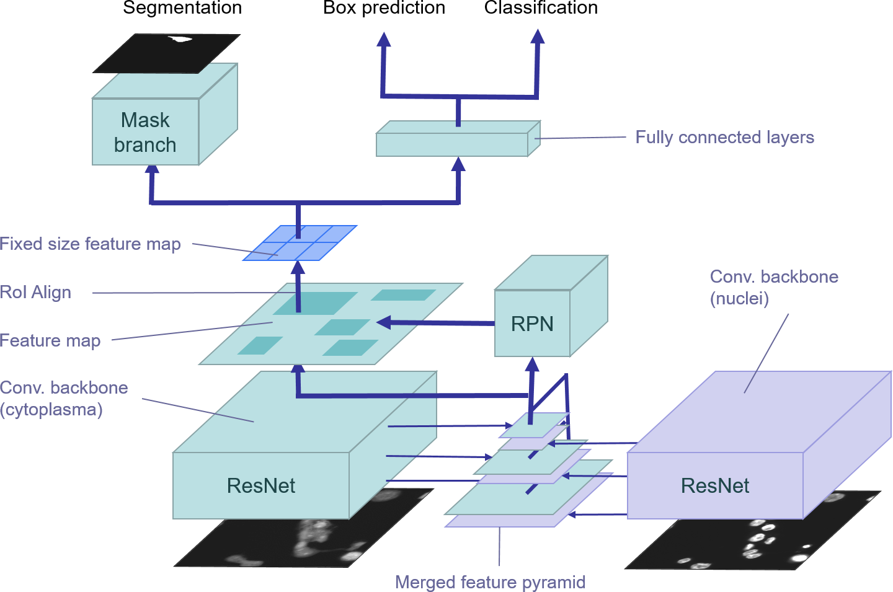
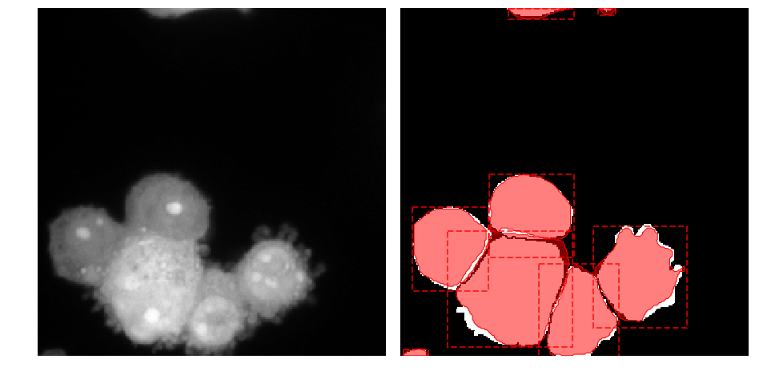

# Feature Pyramid Fusion  for Detection and Segmentation of Morphologically Complex Eukaryotic Cells

Fusion of feature pyramids for nucleus segmentation and cell segmentation. The model uses nucleus and cytoplasma signal to achieve better cell segmentation results.



The code is based on the [Mask R-CNN](https://arxiv.org/abs/1703.06870) implementation of https://github.com/matterport/Mask_RCNN and extends it for feature pyramid fusion.




## Installation

Please see https://github.com/matterport/Mask_RCNN for requirements and installation

## Run model

* Jupyter notebook demo for running models and vizualization: [segmentation_demo.ipynb](samples/cells_and_cores/segmentation_demo.ipynb)

* Training scripts: [cells_and_cores](samples/cells_and_cores)

## Dataset

Full dataset available at: https://hessenbox.uni-marburg.de/getlink/fiWqsAtPVpkX8Y8xH67Pqt/synmikro_macrophages.tar.gz

## Models

* [Pretrained Grayscale ResNet](https://hessenbox.uni-marburg.de/dl/fiE9rpMrLvozR257eQxpCd/pretrained_grayscale_resnet.zip)

* [FPF &oplus; weighted loss](https://hessenbox.uni-marburg.de/dl/fiLyxHi1XkvQVs2sbL97RG/fpf_add_weighted.zip)

* [FPF &odot; weighted loss](https://hessenbox.uni-marburg.de/dl/fi3xqPoncVmMV1ieFWF2GD/fpf_concat_weighted.zip)

* [FPF &oplus;](https://hessenbox.uni-marburg.de/dl/fiXozMVps2o51QZDyV2wxp/fpf_add.zip)

* [FPF &odot;](https://hessenbox.uni-marburg.de/dl/fiMoT5XJ9mV2uAM1t65mRG/fpf_concat.zip)

* [with nucleus channel](https://hessenbox.uni-marburg.de/dl/fi9TZ71FFnihHHCcyYEeGB/with_nucleus.zip)

* [without nucleus channel](https://hessenbox.uni-marburg.de/dl/fiJ1BTqLToksSjgfik9DPh/without_nucleus.zip)

* [Cores](https://hessenbox.uni-marburg.de/dl/fi7ZH1NFGaYDHgGc7bMZEx/cores.zip)

## Reference

```
@article{korfhage2020detection,
  title={Detection and segmentation of morphologically complex eukaryotic cells in fluorescence microscopy images via feature pyramid fusion},
  author={Korfhage, Nikolaus and M{\"u}hling, Markus and Ringshandl, Stephan and Becker, Anke and Schmeck, Bernd and Freisleben, Bernd},
  journal={PLOS Computational Biology},
  volume={16},
  number={9},
  pages={e1008179},
  year={2020},
  publisher={Public Library of Science San Francisco, CA USA}
}
```

